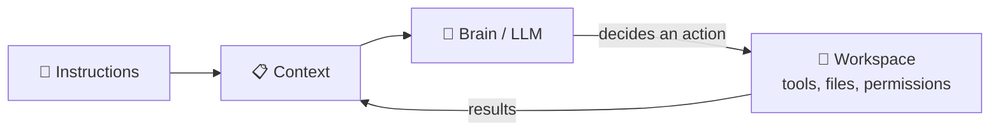
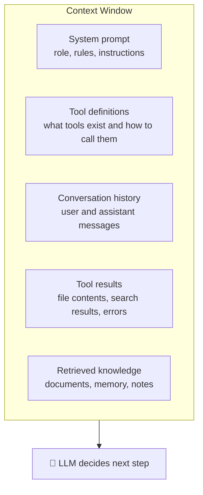
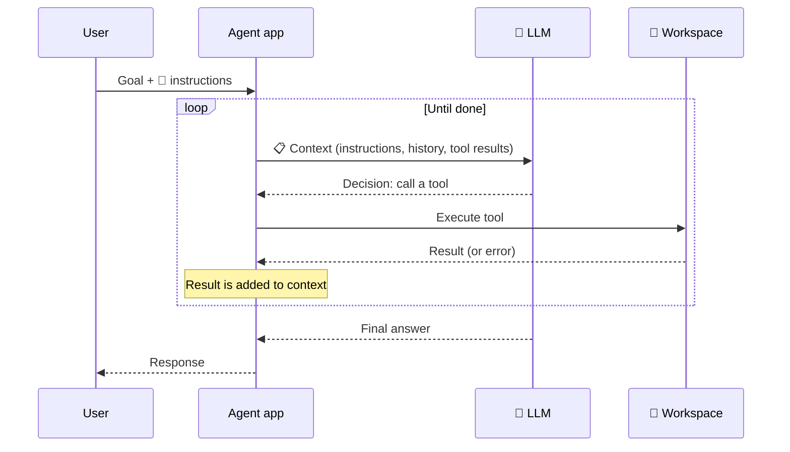
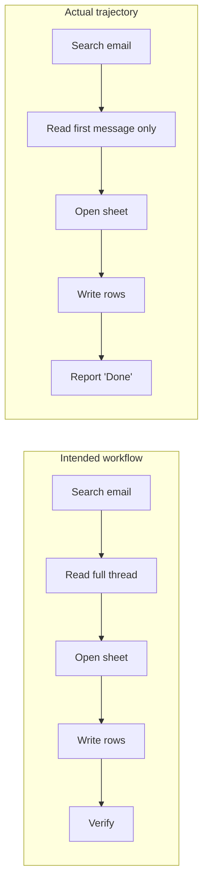

# AI Agents Fundamentals

**How AI agents actually work: the brain, the context, the instructions, and the workspace.**

**Author:** Evangelos Vlachos

> **Part 1 of the Applied AI series.** This guide explains the building blocks of AI agents in plain language. When you're comfortable with these ideas, continue to **Part 2: [Applied AI Engineering Handbook](https://github.com/evangelosvlachos96-dotcom/llm-systems-handbook)**, which covers RAG, evaluation, data quality, and production infrastructure.

---

## Who this is for

Anyone who wants to understand, build, operate, or evaluate AI agents: engineers, architects, product managers, analysts, and AI evaluators. No machine learning background is required. A little Python helps for one optional section.

## The one idea to remember

Every AI agent is made of four parts:

| Part | Question it answers | Human analogy |
|---|---|---|
| 🧠 **Brain** (the LLM) | How does it think and decide? | The employee's intelligence and skills |
| 📋 **Context** | What does it know right now? | Everything on the employee's desk at this moment |
| 📜 **Instructions** | What is it supposed to do, and how? | The job description and the task brief |
| 🧰 **Workspace** | What can it actually reach and change? | The employee's computer, files, and access badges |

Picture a brilliant new employee on their first day. They're smart (brain), but they only know what's in front of them (context), they need a clear brief (instructions), and they can only do what their accounts and tools allow (workspace). If any one of those is missing, even the smartest employee will fail. **Agents fail the same way.**



## Contents

1. [What Is an AI Agent?](#1-what-is-an-ai-agent)
2. [The Brain: The LLM](#2-the-brain-the-llm)
3. [Context: The Agent's Entire World](#3-context-the-agents-entire-world)
4. [Instructions: Telling the Agent What Good Looks Like](#4-instructions-telling-the-agent-what-good-looks-like)
5. [Workspace: What the Agent Can Reach](#5-workspace-what-the-agent-can-reach)
6. [Putting It Together: The Agent Loop](#6-putting-it-together-the-agent-loop)
7. [Workflow vs Trajectory](#7-workflow-vs-trajectory)
8. [Why Agents Fail](#8-why-agents-fail)
9. [How to Judge an Agent's Work](#9-how-to-judge-an-agents-work)
10. [A Minimal Agent in Python](#10-a-minimal-agent-in-python)
11. [Glossary](#11-glossary)
12. [Check Your Understanding](#12-check-your-understanding)

---

## 1. What Is an AI Agent?

There are three levels of AI systems, and the differences matter.

**Chatbot.** You ask, it answers. It can't take actions, and the conversation ends with text.

**Workflow.** Your code runs the AI through fixed steps: first summarize this document, then classify it, then draft an email. The AI does the thinking at each step, but **your code decides the order**.

**Agent.** You give it a goal, and **the AI decides the steps**. It chooses which tools to use, looks at the results, and keeps going until the goal is achieved or it gets stuck.

| | Chatbot | Workflow | Agent |
|---|---|---|---|
| Who decides the steps? | Nobody, single reply | Your code | The AI |
| Takes actions? | No | Yes, predefined | Yes, chosen dynamically |
| Predictability | High | High | Lower |
| Handles surprises | Poorly | Poorly | Well |
| Best for | Questions, drafting | Repeatable processes | Open-ended, multi-step tasks |

A simple test: **if the AI can decide to do something you didn't explicitly script, it's an agent.**

Agents aren't always the right choice. If a task always follows the same steps, a workflow is cheaper, faster, and easier to trust. Use agents when the path can't be predicted in advance.

---

## 2. The Brain: The LLM

### 2.1 What the brain does

The brain of an agent is a **large language model (LLM)**, such as Claude, GPT, or Gemini. At its core, an LLM reads text and predicts what text should come next. That simple mechanism, trained at enormous scale, produces abilities that look like reasoning, planning, writing code, and making decisions.

Inside an agent, the brain has three jobs:

1. **Understand** the goal and the current situation.
2. **Decide** the next action: call a tool, ask a question, or give a final answer.
3. **Interpret** results and adjust the plan.

### 2.2 What the brain cannot do

Understanding the brain's limits prevents most beginner mistakes.

- **It has no memory between calls.** Every time the agent "thinks," the model sees only the text sent to it in that call. Anything that seems like memory is the application re-sending information.
- **It can't see or touch the world by itself.** It can't open files, browse websites, or check a database unless the workspace gives it a tool to do so.
- **Its knowledge has a cutoff date.** It doesn't know about events after its training, or anything private to your company, unless you put that information in its context.
- **It can be confidently wrong.** LLMs can produce plausible but false statements ("hallucinations"), including claiming they did something they didn't do.
- **It isn't perfectly consistent.** The same input can produce different outputs, so one successful run doesn't prove the agent is reliable.

### 2.3 Choosing a brain

| Consideration | What to think about |
|---|---|
| Capability | Harder tasks (long plans, complex code, nuanced judgment) need stronger models |
| Speed | Smaller models respond faster, which matters for interactive use |
| Cost | Pricing is per token; long agent runs can use many tokens |
| Context size | How much information the model can take in at once |
| Tool use quality | How reliably the model calls tools with correct inputs |

A common pattern is to use a strong model for planning and hard decisions, and a smaller, faster model for simple sub-tasks.

### 2.4 Two settings worth knowing

- **Temperature** controls randomness. Lower values make outputs more focused and repeatable; higher values make them more varied.
- **Extended thinking / reasoning** lets some models reason step by step before answering, which usually improves results on hard problems at the cost of time and tokens.

> **Key point:** The brain is powerful but blind. It can only work with what the context shows it and what the workspace lets it do.

---

## 3. Context: The Agent's Entire World

### 3.1 If it isn't in the context, it doesn't exist

The **context** is all the text the model sees when it makes a decision. The maximum amount it can see at once is called the **context window**, measured in **tokens** (a token is roughly three-quarters of an English word).

This is the most important idea in agent engineering: **the model knows nothing except what is in its context at that moment.** It doesn't know what's in a file it hasn't opened, what was said in a meeting nobody wrote down, or what the user "obviously meant."

### 3.2 What goes into the context



| Ingredient | Example |
|---|---|
| System prompt | "You are a finance assistant. Never modify approved budgets." |
| Tool definitions | `read_file(path)`, `send_email(to, subject, body)` |
| Conversation history | The user's request and previous turns |
| Tool results | The contents of a spreadsheet the agent just opened |
| Retrieved knowledge | Company policy documents found by a search |
| Memory | Notes saved from earlier sessions |

### 3.3 More context isn't always better

It's tempting to dump everything into the context. That backfires:

- **Context limits:** eventually the window fills up.
- **Distraction:** irrelevant information makes the model more likely to focus on the wrong thing. Quality can degrade as the context grows cluttered, sometimes called **context rot**.
- **Cost and speed:** every token is paid for and processed on every call.

The goal is **the right information, at the right time, in the right amount.** Designing this deliberately is called **context engineering**.

### 3.4 Context engineering techniques

| Technique | What it does | When to use it |
|---|---|---|
| Retrieval (search) | Fetch only relevant documents when needed | Large knowledge bases |
| Just-in-time loading | Give the agent tools to open files itself instead of pre-loading everything | Big workspaces |
| Summarization / compaction | Replace long old history with a short summary | Long conversations |
| Clearing old tool results | Remove bulky outputs that are no longer needed | Many tool calls |
| Notes and memory files | The agent writes key facts down and reads them later | Multi-session or long tasks |
| Sub-agents | Delegate a messy sub-task to a helper that returns only its conclusion | Research and exploration |

### 3.5 Common context problems

| Problem | What you'll see |
|---|---|
| **Missing context** | The agent guesses, invents details, or asks for information it could have found |
| **Stale context** | It uses an outdated version of a file or figure |
| **Ignored context** | The information was available, but the agent never opened or read it |
| **Noisy context** | Correct information is present but buried, so the agent uses the wrong part |
| **Conflicting context** | Two sources disagree, and the agent picks one without noticing |

> **Key point:** When an agent makes a mistake, ask first: *"Did it have the right information at the moment it decided?"* Most of the time, the answer explains the failure.

---

## 4. Instructions: Telling the Agent What Good Looks Like

### 4.1 Instructions vs context

Instructions are technically part of the context, but they play a special role. **Context is what the agent knows. Instructions are what the agent is supposed to do and how.** They usually live in the **system prompt** (standing rules for every task) and the **task prompt** (the specific request).

### 4.2 What good instructions include

| Element | Purpose | Example |
|---|---|---|
| **Role** | Sets expertise and tone | "You are an accounts-payable assistant for a mid-size company." |
| **Goal** | What outcome is wanted | "Record all September expenses in the budget sheet." |
| **Success criteria** | How to know the job is done well | "Every expense from the email thread appears once, with the correct amount and category." |
| **Constraints** | What must never happen | "Don't edit rows before September. Don't send emails." |
| **Process** | Recommended steps and checkpoints | "Read the entire thread, including replies, before writing anything." |
| **Output format** | What the final response looks like | "End with a table of added rows and a list of flagged items." |
| **When to stop or ask** | Handling uncertainty | "If an amount is ambiguous, don't guess; list it under 'Needs review.'" |

### 4.3 Weak vs strong instructions

**Weak:**
```text
Update the budget with the expenses from the emails.
```

**Strong:**
```text
You are an accounts-payable assistant.

Goal: Add all September 2026 expenses from the "September expenses" email thread
to budget.xlsx, sheet "2026".

Steps:
1. Read every message in the thread, including replies. Later messages may
   correct earlier amounts; always use the most recent correction.
2. Add one row per expense: date, vendor, amount, category.
3. Flag any single expense over $5,000 by writing "REVIEW" in column F.
4. Re-open the sheet and verify the rows you added match the emails.

Constraints:
- Only add rows. Never edit or delete existing rows.
- If an amount or category is unclear, do not guess. List it under "Needs review."

Final response: a table of rows added, the list of flagged items, and anything
that needs review.
```

The strong version isn't just longer. It removes guesswork, tells the agent about a known trap (corrections in replies), adds a verification step, and defines what "done" means.

### 4.4 Principles for writing instructions

- **Explain the why.** "Don't edit existing rows, because they're already approved by finance" helps the model handle situations your rules didn't anticipate.
- **Find the right altitude.** Too vague and the agent guesses; too rigid and it breaks on anything unexpected. Give clear goals and guardrails, not a script for every keystroke.
- **Show examples.** One or two examples of a good output often work better than paragraphs of description.
- **Avoid contradictions.** "Be thorough" and "keep it under 50 words" pull in opposite directions. Decide which wins.
- **Put checkpoints in the process.** Asking the agent to verify its work catches many errors before they reach you.
- **Say what to do when stuck.** Without this, agents tend to guess or declare success.

> **Key point:** Vague instructions don't make an agent flexible. They make it unpredictable.

---

## 5. Workspace: What the Agent Can Reach

### 5.1 The agent acts only through its workspace

The **workspace** is everything the agent can access and change: **tools, files, systems, and permissions.** The brain decides what to do, but the workspace determines what is *possible*. An agent asked to "check the latest sales numbers" can't do it without a tool that reaches the sales data.

### 5.2 Tools

A **tool** is a function the agent can call. Each tool has a name, a description, and a defined set of inputs. The model reads these definitions (they're part of the context) and decides when to call them.

```json
{
  "name": "read_spreadsheet",
  "description": "Read rows from a sheet in an Excel file. Returns rows as JSON. Use start_row and max_rows to page through large sheets.",
  "input_schema": {
    "type": "object",
    "properties": {
      "path": { "type": "string", "description": "File path, e.g. 'finance/budget.xlsx'" },
      "sheet": { "type": "string" },
      "start_row": { "type": "integer", "default": 1 },
      "max_rows": { "type": "integer", "default": 100 }
    },
    "required": ["path", "sheet"]
  }
}
```

Common tool types:

| Type | Examples |
|---|---|
| Read | Read a file, search documents, query a database, fetch a web page |
| Write | Create or edit a file, update a record |
| Communicate | Send an email or chat message |
| Execute | Run code or shell commands |
| Delegate | Hand a sub-task to another agent |

### 5.3 What makes a good tool

- **A clear name and description**, written as if explaining it to a new colleague.
- **Strict, simple inputs.** Use fixed choices (enums) instead of free text where possible.
- **Helpful error messages.** "File not found: 'budgt.xlsx'. Did you mean 'budget.xlsx'?" lets the agent recover.
- **Right-sized outputs.** Returning 50,000 lines floods the context; offer paging or summaries.
- **No overlap.** Two tools that do nearly the same thing confuse the agent about which to use.

### 5.4 Permissions and safety

Give the agent **the least access it needs** to do the job.

| Risk level | Examples | Safeguard |
|---|---|---|
| Low | Reading public documents | Allow freely |
| Medium | Editing drafts, writing to a test folder | Allow, with logging |
| High | Sending emails, spending money, deleting data, deploying code | Require human approval |

Other safeguards: run code in a **sandbox** (an isolated environment that can't harm real systems), keep **logs** of every action, and treat text the agent reads from websites or documents as **untrusted**, since it may contain hidden instructions (**prompt injection**).

### 5.5 A note on MCP

The **Model Context Protocol (MCP)** is an open standard for connecting agents to tools and data sources. An MCP server exposes tools (for example, for a calendar, a database, or a code repository), and any compatible agent can use them. It works like a universal adapter, so each integration doesn't need to be rebuilt for every agent.

> **Key point:** An agent can't be blamed for not using a tool it didn't have, but it *can* be blamed for claiming it used one.

---

## 6. Putting It Together: The Agent Loop

Every agent runs the same basic cycle: **think, act, observe, repeat.**



### Worked example

**Goal:** "Add September expenses from the email thread to the budget sheet and flag anything over $5,000."

| Step | 🧠 Brain thinks | 🧰 Workspace action | 📋 Context now contains |
|---|---|---|---|
| 1 | "I need to find the thread first." | `search_email("September expenses")` | Instructions + search results |
| 2 | "Thread found. Read all messages." | `read_email_thread(id)` | + 4 messages, including a correction |
| 3 | "Message 4 corrects the catering amount to $5,400." | none (reasoning) | + its own reasoning |
| 4 | "Now open the sheet." | `read_spreadsheet("budget.xlsx", "2026")` | + existing rows |
| 5 | "Add 12 rows; catering is over $5,000." | `write_rows(...)` | + write confirmation |
| 6 | "Verify before finishing." | `read_spreadsheet(...)` | + updated rows |
| 7 | "Everything matches. Report." | none | Final answer |

Each of the four parts was essential. Without **instructions** mentioning corrections, step 3 might be skipped. Without the **workspace** email tool, step 1 is impossible. If the correction message were missing from the **context**, the amount would be wrong. And the **brain** had to connect the correction to the right row.

---

## 7. Workflow vs Trajectory

Two terms help you reason about what an agent was supposed to do versus what it actually did.

- **Workflow:** the intended path, meaning the steps, their order, and the checkpoints (from the instructions, or from how an expert would do the task).
- **Trajectory:** the actual path the agent took, meaning every thought, tool call, and result, in order.



In this example, the trajectory drifted in two places: it skipped the rest of the thread (missing the correction) and skipped verification. The final message may still say "Done, all expenses added," but **the trajectory reveals the problem.** Reading trajectories is the core skill of operating and evaluating agents.

---

## 8. Why Agents Fail

Almost every failure maps back to one of the four parts.

| Part | Typical failures | Typical fixes |
|---|---|---|
| 📋 **Context** | Missing, stale, ignored, noisy, or conflicting information | Provide the data, add retrieval, instruct it to read fully, trim clutter |
| 📜 **Instructions** | Vague goal, no success criteria, contradictions, no guidance for uncertainty | Rewrite with goal, constraints, steps, checkpoints, stop conditions |
| 🧰 **Workspace** | Missing tool, confusing tool description, bad error messages, too much or too little permission | Add or redesign tools, improve errors, adjust permissions |
| 🧠 **Brain** | Reasoning errors on hard tasks, inconsistency across runs | Stronger model, extended thinking, break the task into smaller steps |

Behaviors you'll see in practice:

- **Claiming actions it didn't take** ("I've verified the totals" with no verification step)
- **Looping** by calling the same tool with the same inputs repeatedly
- **Drifting** from the original instructions during long tasks
- **Ignoring errors** and continuing as if a tool call succeeded
- **Fabricating** data when a file or result is missing
- **Stopping early** and declaring success
- **Following injected instructions** found inside a document or web page

### A debugging order that saves time

When an agent fails, check in this order:

1. **Context:** Did it have the information it needed at the moment it decided?
2. **Instructions:** Was it clearly told what to do, what "done" means, and what to do when unsure?
3. **Workspace:** Did it have the right tools and access, and did the tools behave well?
4. **Brain:** Only after ruling out the first three, consider whether the model itself isn't capable enough.

People often blame the model first. In practice, the first three are the cause far more often, and they're cheaper to fix.

---

## 9. How to Judge an Agent's Work

### 9.1 Evidence over self-report

The agent's final message is a claim, not proof. **"I updated the file and verified the totals" means nothing until you check the file and the totals.** Always verify against the actual outcome and the trajectory.

### 9.2 Look at two things

- **Outcome:** Is the end result correct? Check the real file, record, or answer against the source.
- **Process:** Was the path sound? Did it read what it needed, avoid unsafe actions, and verify its work? An agent that got the right answer by luck is still unreliable.

### 9.3 A simple review checklist

1. What was the goal, and what does success look like?
2. What context, instructions, and tools did the agent have?
3. Walk through the trajectory step by step. Where does it differ from the intended workflow?
4. Verify the output against the source, not against the agent's summary.
5. Was the result correct? Was the process safe and sound?
6. If it failed, which of the four parts caused it?
7. What specific change would fix it? Re-run and check again.

### 9.4 Be calibrated

Separate what you **verified** from what you **assumed**. "Rows 2 to 40 match the emails; I didn't check the summary chart" is more useful than "looks good." One successful run isn't proof of reliability, since agents can behave differently each time. Run important tasks several times before trusting them.

---

## 10. A Minimal Agent in Python

This optional section shows all four parts in about 60 lines of real code, using the Anthropic Python SDK. The same structure applies to any provider.

```python
# pip install anthropic
# export ANTHROPIC_API_KEY=...
import anthropic

client = anthropic.Anthropic()

# 🧠 BRAIN: which model makes the decisions
MODEL = "claude-sonnet-5"

# 📜 INSTRUCTIONS: role, goal, constraints, stop conditions
SYSTEM_PROMPT = """You are a helpful file assistant.
Use tools to read files before answering questions about them.
Never invent file contents. If a file is missing, say so.
Keep final answers short."""

# 🧰 WORKSPACE: the files and tools the agent can reach
FILES = {
    "notes.txt": "Team meeting moved to Thursday 10:00.",
    "todo.txt": "1. Send report\n2. Book venue",
}

TOOLS = [{
    "name": "read_file",
    "description": "Read a text file from the workspace by name.",
    "input_schema": {
        "type": "object",
        "properties": {"name": {"type": "string"}},
        "required": ["name"],
    },
}, {
    "name": "list_files",
    "description": "List all file names available in the workspace.",
    "input_schema": {"type": "object", "properties": {}},
}]

def run_tool(name: str, args: dict) -> str:
    if name == "list_files":
        return ", ".join(FILES)
    if name == "read_file":
        return FILES.get(args["name"], f"Error: '{args['name']}' not found. Use list_files.")
    return f"Error: unknown tool '{name}'"

def run_agent(goal: str, max_steps: int = 8) -> str:
    # 📋 CONTEXT: starts with the goal and grows with every step
    messages = [{"role": "user", "content": goal}]

    for step in range(max_steps):  # the agent loop, with a safety limit
        response = client.messages.create(
            model=MODEL, max_tokens=1024, system=SYSTEM_PROMPT,
            tools=TOOLS, messages=messages,
        )
        messages.append({"role": "assistant", "content": response.content})

        if response.stop_reason != "tool_use":  # no tool requested: final answer
            return "".join(b.text for b in response.content if b.type == "text")

        results = []
        for block in response.content:
            if block.type == "tool_use":
                output = run_tool(block.name, block.input)
                print(f"[step {step + 1}] {block.name}({block.input}) -> {output!r}")
                results.append({"type": "tool_result",
                                "tool_use_id": block.id, "content": output})
        messages.append({"role": "user", "content": results})  # observe

    return "Stopped: reached the step limit."

print(run_agent("When is the team meeting, and what's first on my to-do list?"))
```

The printed lines are the **trajectory**. Try breaking one part at a time to see how the agent fails: remove `list_files` (workspace), delete the system prompt rules (instructions), change a file's contents (context), or switch to a smaller model (brain).

> Model names change over time. Check your provider's documentation for current model identifiers.

---

## 11. Glossary

| Term | Meaning |
|---|---|
| **Agent** | An AI system that decides its own steps and uses tools to reach a goal |
| **LLM** | Large language model, the "brain" that reads text and generates responses |
| **Token** | A chunk of text, roughly ¾ of a word; the unit for context size and pricing |
| **Context** | All the text the model sees when making a decision |
| **Context window** | The maximum amount of context a model can process at once |
| **Context engineering** | Deliberately designing what information the agent sees, and when |
| **System prompt** | Standing instructions given to the model for every interaction |
| **Tool** | A function the agent can call to read, write, or act in its workspace |
| **Workspace** | Everything the agent can access: tools, files, systems, permissions |
| **Agent loop** | The repeating cycle of think, act, and observe |
| **Workflow** | The intended steps and checkpoints for a task |
| **Trajectory** | The actual sequence of steps the agent took |
| **Hallucination** | A confident but false output |
| **Prompt injection** | Malicious instructions hidden in content the agent reads |
| **Sandbox** | An isolated environment where the agent can act safely |
| **Human-in-the-loop** | A person approving or reviewing agent actions at key points |
| **MCP** | Model Context Protocol, an open standard for connecting agents to tools |

---

## 12. Check Your Understanding

1. What are the four parts of an agent, and what does each one answer?
2. What's the difference between a workflow and an agent? When would you choose a workflow?
3. Why can't the LLM remember previous tasks by itself?
4. Give three reasons why adding more context can make an agent worse.
5. Rewrite this weak instruction into a strong one: *"Summarize the customer complaints."*
6. What makes a good tool description? Why do error messages matter?
7. Which actions should require human approval, and why?
8. An agent reports "All done, I checked everything," but the output is wrong. How do you investigate?
9. What's the difference between the workflow and the trajectory, and why does it matter?
10. In what order should you debug a failing agent, and why is the brain last?

---

## What's Next

You now understand how agents work. **Part 2, the [Applied AI Engineering Handbook](https://github.com/evangelosvlachos96-dotcom/llm-systems-handbook)**, goes deeper into building them for production:

- Orchestration patterns and multi-agent systems
- RAG: chunking, hybrid search, reranking, and evaluation
- Evaluation harnesses, LLM-as-judge, pass@k and pass^k
- Data taxonomy, labeling, and annotator agreement
- Post-training (SFT, RLHF, DPO, RL environments)
- Inference, infrastructure, and production Python patterns

---

## Further Reading

- Anthropic, *Building Effective Agents* (2024)
- Anthropic, *Effective Context Engineering for AI Agents*
- Anthropic, *Writing Effective Tools for AI Agents*
- Anthropic documentation: prompt engineering and tool use guides
- Model Context Protocol documentation: modelcontextprotocol.io
- Yao et al., *ReAct: Synergizing Reasoning and Acting in Language Models* (2022)
- OWASP, *Top 10 for Large Language Model Applications* (prompt injection and agent risks)

---

## Contributing

Found an error or have a suggestion? Issues and pull requests are welcome.

## Author

**Evangelos Vlachos**, Solution Architect

## License

© 2026 Evangelos Vlachos. Text licensed under [CC BY 4.0](https://creativecommons.org/licenses/by/4.0/). Code licensed under MIT.


